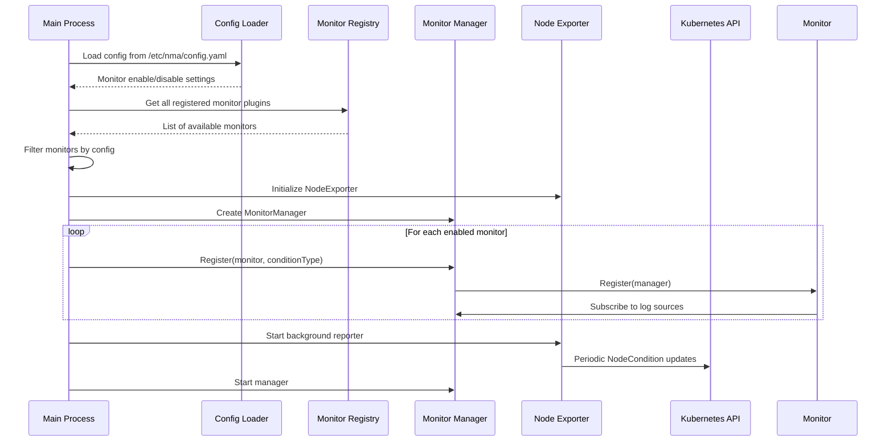
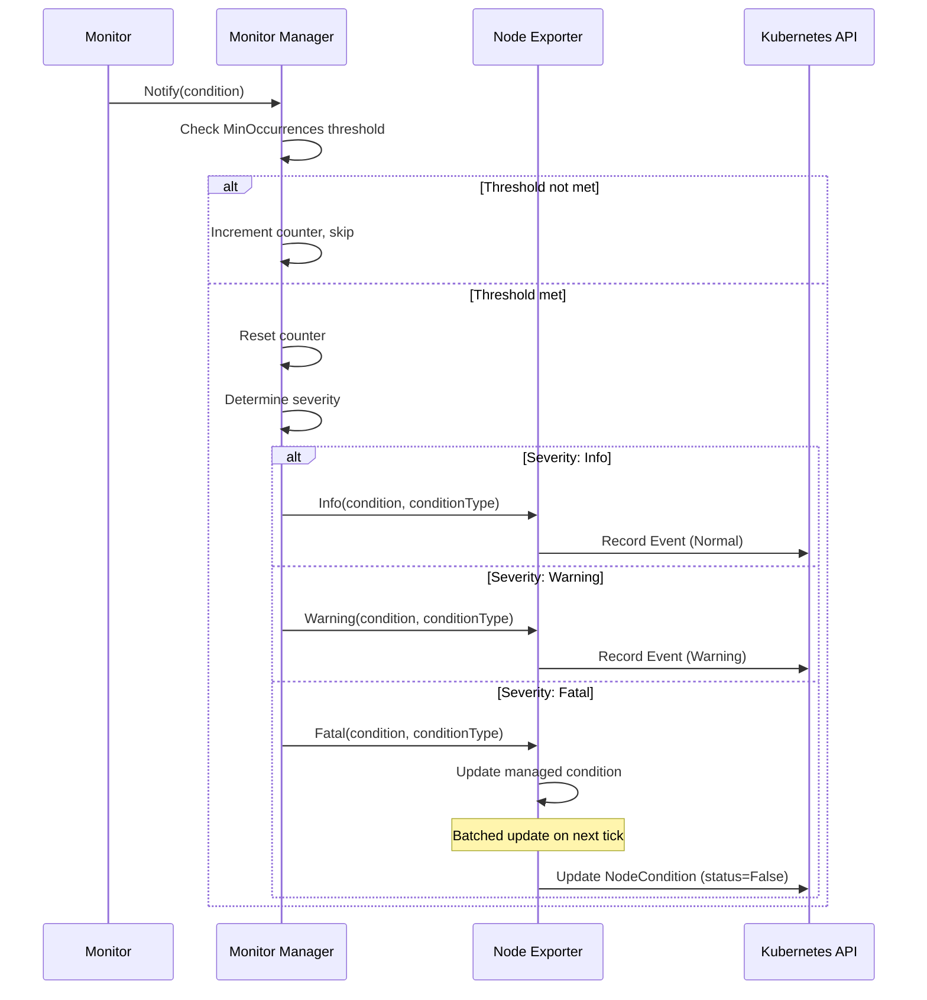
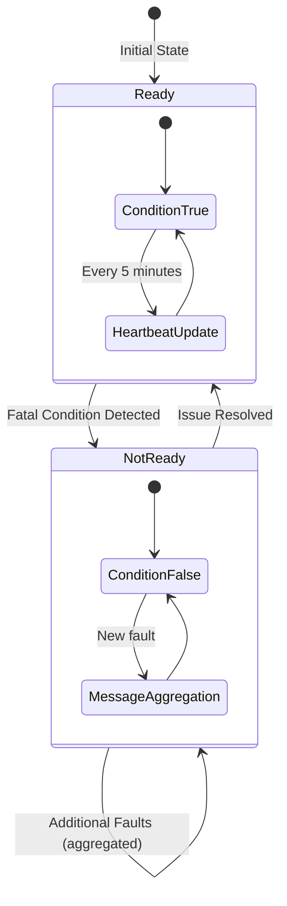
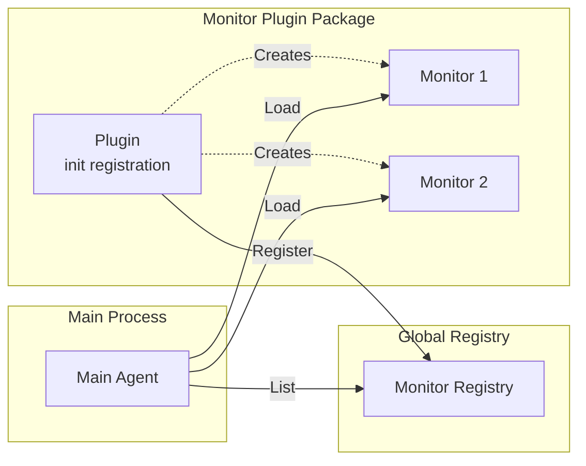
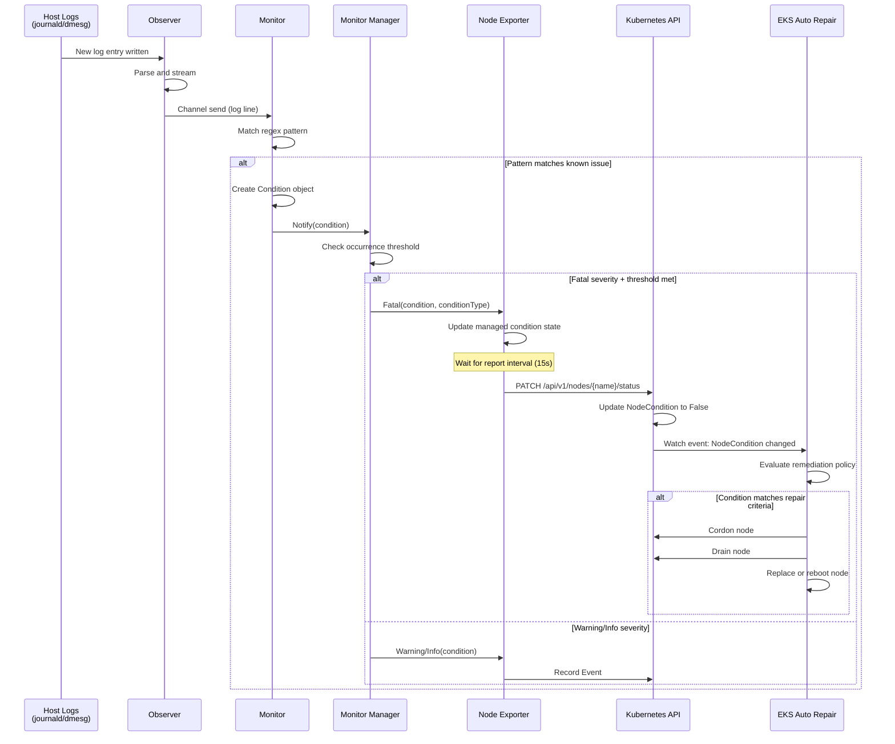
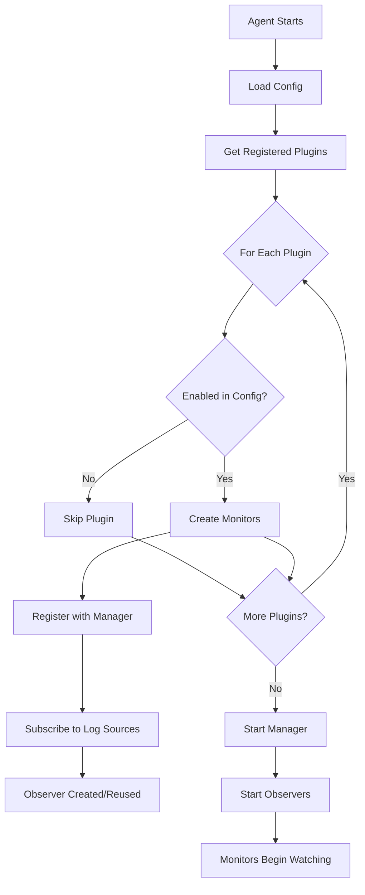
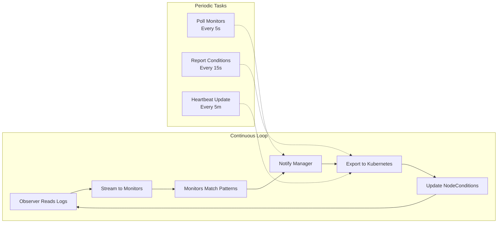
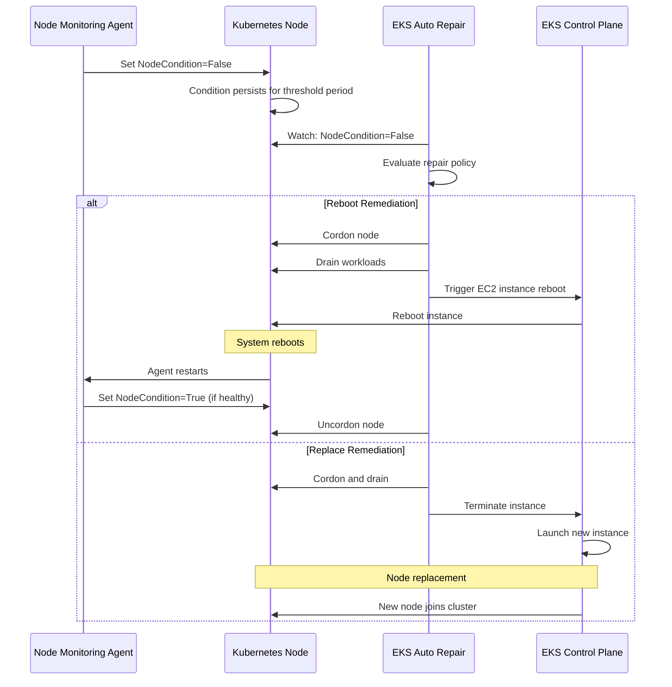
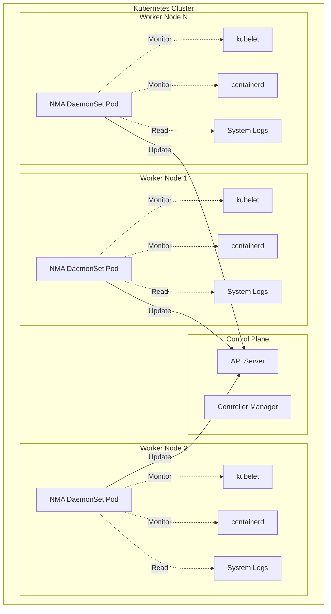

# EKS Node Monitoring Agent - Architecture

This document provides a comprehensive overview of the EKS Node Monitoring Agent's architecture, component interactions, and data flow.

## Table of Contents
- [High-Level Overview](#high-level-overview)
- [Component Architecture](#component-architecture)
- [Data Flow](#data-flow)
- [Monitor Lifecycle](#monitor-lifecycle)
- [Integration with EKS Auto Repair](#integration-with-eks-auto-repair)
- [Deployment Model](#deployment-model)

---

## High-Level Overview

The EKS Node Monitoring Agent is a Kubernetes DaemonSet that runs on each EKS worker node to detect and report node health issues. It monitors various subsystems (kernel, networking, storage, GPU, etc.) and surfaces status information through Kubernetes `NodeConditions`.

```mermaid
graph TB
    subgraph "EKS Worker Node"
        subgraph "Agent Container (Privileged)"
            MA[Main Agent Process]
            MM[Monitor Manager]
            NE[Node Exporter]
            
            subgraph "Monitors"
                KM[Kernel Monitor]
                NM[Network Monitor]
                SM[Storage Monitor]
                RM[Runtime Monitor]
                GM[GPU Monitor]
                NUM[Neuron Monitor]
            end
            
            subgraph "Observers"
                JO[Journald Observer]
                DO[Dmesg Observer]
                LO[Log File Observer]
            end
        end
        
        subgraph "Host System"
            SL[System Logs<br/>/var/log/messages<br/>/var/log/syslog]
            JD[Journald<br/>/run/log/journal]
            DM[Dmesg Buffer]
            PR[/proc filesystem]
            SY[/sys filesystem]
            NV[NVIDIA DCGM<br/>GPU Metrics]
            CR[Container Runtime<br/>CRI API]
        end
    end
    
    subgraph "Kubernetes API Server"
        NC[Node Status<br/>NodeConditions]
        EV[Events]
        ND[NodeDiagnostic CRD]
    end
    
    subgraph "EKS Control Plane"
        AR[EKS Auto Repair]
    end
    
    %% Observer connections
    JO -->|Read| JD
    DO -->|Read| DM
    LO -->|Read| SL
    
    %% Monitor connections to host
    KM -.->|Parse| JO
    KM -.->|Parse| DO
    NM -.->|Parse| JO
    NM -.->|Read| PR
    SM -.->|Parse| JO
    SM -.->|Read| SY
    RM -.->|CRI API| CR
    GM -.->|DCGM API| NV
    NUM -.->|Read| SY
    
    %% Internal flow
    KM & NM & SM & RM & GM & NUM -->|Notify| MM
    MM -->|Export| NE
    NE -->|Update| NC
    NE -->|Record| EV
    MA -->|Reconcile| ND
    
    %% External integration
    NC -->|Watch| AR
    AR -.->|Trigger Remediation| EKS Worker Node
    
    style MA fill:#ff9900
    style MM fill:#ff9900
    style NE fill:#ff9900
    style AR fill:#232f3e
```

**Key Components:**
- **Main Agent Process**: Initializes and orchestrates all components using controller-runtime
- **Monitor Manager**: Coordinates monitor lifecycle and routes notifications
- **Node Exporter**: Translates monitor conditions into Kubernetes NodeConditions and Events
- **Monitors**: Subsystem-specific health checkers (kernel, network, storage, GPU, etc.)
- **Observers**: Log parsing engines (journald, dmesg, log files)

---

## Component Architecture

### 1. Main Agent Process (`cmd/eks-node-monitoring-agent/main.go`)

**Responsibilities:**
- Bootstrap Kubernetes client and controller-runtime manager
- Load monitor configuration from `/etc/nma/config.yaml`
- Register enabled monitors with the Monitor Manager
- Initialize Node Exporter for NodeCondition updates
- Start NodeDiagnostic controller for log collection
- Provide health/readiness endpoints (`:8081`) and Prometheus metrics (`:8080`)

**Initialization Flow:**


---

### 2. Monitor Manager (`pkg/manager/manager.go`)

**Responsibilities:**
- Manage monitor lifecycle (registration, subscription, notification)
- Route notifications from monitors to the Node Exporter
- Coordinate observer lifecycle (journald, dmesg, log file readers)
- Implement resource subscription pattern for log sources
- Track condition occurrence counts for de-duplication

**Key Interfaces:**
```go
// Monitor Manager implements monitor.Manager interface
type Manager interface {
    Subscribe(resourceType, resourceParts) (<-chan string, error)
    Notify(ctx, condition) error
}
```

**Notification Flow:**


**Resource Subscription Pattern:**
Monitors subscribe to log sources through the manager, which lazily creates observers on-demand:

```
Monitor → Subscribe(Journald, [systemd-unit]) → Observer created/reused → Log stream
```

---

### 3. Node Exporter (`pkg/manager/node_exporter.go`)

**Responsibilities:**
- Translate monitor conditions into Kubernetes primitives (NodeConditions, Events)
- Batch multiple condition updates to minimize API calls
- Maintain condition state (ready/not ready) for each subsystem
- Provide heartbeat mechanism to indicate agent liveness
- Handle condition aggregation (multiple issues on same condition type)

**State Management:**


**Update Intervals:**
- **Report Interval**: 15 seconds (batches multiple condition updates)
- **Heartbeat Interval**: 5 minutes (updates LastHeartbeatTime)
- **Poll Interval**: 5 seconds (queries monitors for current state)

**Condition Types Managed:**
| NodeCondition | Monitor | Meaning |
|---------------|---------|---------|
| `KernelReady` | kernel-monitor | Kernel is functioning without critical errors |
| `StorageReady` | storage-monitor | Disk I/O is healthy, no EBS throttling |
| `NetworkingReady` | networking | VPC CNI, network interfaces operational |
| `ContainerRuntimeReady` | runtime | Container runtime (containerd/docker) healthy |
| `AcceleratedHardwareReady` | nvidia/neuron | GPU or Neuron hardware healthy |

---

### 4. Monitors

Each monitor is a plugin that implements the `monitor.Monitor` interface:

```go
type Monitor interface {
    Name() string
    Register(ctx, manager) error
    Conditions() []Condition
}
```

#### Monitor Plugin Architecture



**Auto-registration via `init()`:**
```go
// monitors/kernel/plugin.go
func init() {
    registry.MustRegister(NewPlugin())
}
```

#### Monitor Types

##### Kernel Monitor (`monitors/kernel/`)
- **Purpose**: Detect kernel-level issues (OOM kills, panics, soft lockups, process limits)
- **Log Sources**: Journald, dmesg
- **Key Patterns**:
  - `"Out of memory: Killed process"` → OOMKill condition
  - `"CIFS VFS: No response for cmd"` → CIFS timeout
  - `"task blocked for more than"` → Hung task

##### Networking Monitor (`monitors/networking/`)
- **Purpose**: Detect VPC CNI issues, interface problems, iptables rejects
- **Log Sources**: Journald (aws-node logs), procfs
- **Key Patterns**:
  - `"failed to assign an IP address to container"` → IP exhaustion
  - Unexpected iptables REJECT rules in filter/INPUT chain
  - Interface state monitoring via netlink

##### Storage Monitor (`monitors/storage/`)
- **Purpose**: Detect EBS throttling, I/O delays, filesystem errors
- **Log Sources**: Journald, sysfs (`/sys/block/*/stat`)
- **Key Patterns**:
  - `"operation not permitted"` on EBS volumes
  - IOPS/throughput throttling detection via device stats
  - Filesystem corruption indicators

##### Runtime Monitor (`monitors/runtime/`)
- **Purpose**: Detect container runtime issues (pod termination, probe failures)
- **Log Sources**: CRI API (containerd/dockershim)
- **Key Checks**:
  - Container startup failures
  - Liveness/readiness probe failures
  - Pod evictions

##### NVIDIA GPU Monitor (`monitors/nvidia/`)
- **Purpose**: Detect GPU hardware faults via DCGM telemetry
- **Log Sources**: NVIDIA DCGM API (`libdcgm.so`)
- **Key Metrics**:
  - XID error codes (critical hardware faults)
  - Fabric health mask (NVLink degradation)
  - GPU temperature/power anomalies
  - DCGM watchfields for real-time fault detection

##### Neuron Monitor (`monitors/neuron/`)
- **Purpose**: Detect AWS Neuron accelerator issues
- **Log Sources**: Sysfs (`/sys/class/neuron_device/`)
- **Key Checks**:
  - Neuron device availability
  - Runtime errors from neuron-rtd

---

### 5. Observers (`pkg/observer/`)

Observers are log stream parsers that provide a subscription-based interface for monitors:

```go
type Observer interface {
    Init(ctx) error
    Subscribe() <-chan string
}
```

#### Journald Observer
- Reads systemd journal via D-Bus (`github.com/coreos/go-systemd/v22`)
- Filters by systemd unit (e.g., `kubelet.service`, `aws-node`)
- Tails logs in real-time from the host's `/run/log/journal`

#### Dmesg Observer
- Reads kernel ring buffer via `/dev/kmsg`
- Provides kernel messages without systemd dependency
- Used for early boot issues and kernel panics

#### Log File Observer
- Watches traditional log files (`/var/log/messages`, `/var/log/syslog`)
- Uses `fsnotify` for change detection
- Fallback for systems without journald

---

## Data Flow

### End-to-End: Log Entry to Node Replacement



---

## Monitor Lifecycle

### Registration Phase



### Runtime Phase



---

## Integration with EKS Auto Repair

The EKS Auto Repair feature watches for specific `NodeCondition` values and automatically remediates unhealthy nodes.

### Remediation Workflow



### Condition-to-Remediation Mapping

| NodeCondition | Remediation Action | Notes |
|---------------|-------------------|-------|
| `KernelReady=False` | Replace | Kernel panics, OOM thrashing |
| `StorageReady=False` | Reboot | EBS throttling usually transient |
| `NetworkingReady=False` | Replace | CNI persistent failures |
| `ContainerRuntimeReady=False` | Reboot | Runtime restart may resolve |
| `AcceleratedHardwareReady=False` | Replace | GPU/Neuron hardware faults |

**Note**: Actual remediation policy is configured in EKS Auto Repair settings, not by the agent.

---

## Deployment Model

### DaemonSet Architecture



### Privileged Access Requirements

The agent requires elevated permissions to access host resources:

| Resource | Path | Purpose | Required Permission |
|----------|------|---------|-------------------|
| Host filesystem | `/host` | Access logs, proc, sys | `hostPath` mount |
| Journald socket | `/run/log/journal` | Read systemd logs | D-Bus access |
| Kernel ring buffer | `/dev/kmsg` | Read dmesg | `privileged: true` |
| Container runtime socket | `/var/run/containerd/containerd.sock` | CRI API access | Socket mount |
| DCGM library | `/usr/lib64/libdcgm.so` | GPU monitoring | Shared library |
| PID namespace | Host PID namespace | Process inspection | `hostPID: true` |

**Security Context:**
```yaml
securityContext:
  privileged: true  # Required for /dev/kmsg, hardware access
  capabilities:
    add:
      - SYS_ADMIN   # Required for certain host operations
      - NET_ADMIN   # Required for network diagnostics
```

---

## Configuration

### Agent Configuration (`/etc/nma/config.yaml`)

```yaml
monitors:
  kernel-monitor:
    enabled: true
  networking:
    enabled: true
    allowedIPTablesChains:
      - "filter/CUSTOM-CHAIN"  # Suppress false positives
  storage-monitor:
    enabled: true
  nvidia:
    enabled: true  # Auto-disabled on non-GPU nodes
  neuron:
    enabled: false
  runtime:
    enabled: true
```

### Helm Chart Configuration

The agent is deployed via Helm chart with configurable values:

```yaml
nodeAgent:
  image:
    repository: eks/eks-node-monitoring-agent
    tag: v1.0.0
  resources:
    requests:
      memory: "128Mi"
      cpu: "100m"
    limits:
      memory: "256Mi"
      cpu: "200m"
  monitors:
    networking:
      enabled: true
      allowedIPTablesChains: []
    neuron:
      enabled: false  # Only enable on Neuron nodes
```

---

## Observability

### Prometheus Metrics

The agent exposes metrics on `:8080/metrics`:

| Metric | Type | Labels | Description |
|--------|------|--------|-------------|
| `problem_condition_count` | Counter | `severity`, `reason` | Number of conditions detected |
| `fatal_condition_gauge` | Gauge | `type` | Current fatal condition state (0=healthy, 1=unhealthy) |

**Example PromQL Queries:**
```promql
# Rate of fatal conditions by node
rate(problem_condition_count{severity="Fatal"}[5m])

# Nodes with active fatal conditions
fatal_condition_gauge == 1

# Most common failure reasons
topk(5, sum by (reason) (problem_condition_count))
```

### Health Endpoints

- **Healthz**: `GET :8081/healthz` - Returns 200 if agent is running
- **Readyz**: `GET :8081/readyz` - Returns 200 if agent is ready to monitor

### Kubernetes Events

Monitors emit Kubernetes Events for Info/Warning conditions:

```yaml
type: Warning
reason: NetworkingReady
message: "FailedToAllocateIPAddress: failed to assign an IP address to container"
involvedObject:
  kind: Node
  name: ip-10-0-1-42.ec2.internal
```

---

## NodeDiagnostic CRD

For advanced troubleshooting, operators can create a `NodeDiagnostic` CR to collect detailed logs:

```yaml
apiVersion: eks.amazonaws.com/v1alpha1
kind: NodeDiagnostic
metadata:
  name: debug-node-1
spec:
  nodeName: ip-10-0-1-42.ec2.internal
  logCollectionPaths:
    - /var/log/messages
    - /var/log/syslog
  uploadToS3:
    bucket: my-diagnostics-bucket
    prefix: node-logs/
```

The agent watches for NodeDiagnostic resources targeting its node, collects the specified logs, and uploads them to S3.

---

## Design Principles

1. **Fail-Safe**: Agent failures should never impact workload pods
2. **Low Overhead**: Minimal CPU/memory footprint (~100MB, <5% CPU)
3. **Autonomous**: No external dependencies beyond Kubernetes API
4. **Extensible**: Plugin-based architecture for new monitors
5. **Observable**: Rich metrics and events for troubleshooting
6. **Defensive**: De-duplication, rate limiting, and threshold-based alerting

---

## Performance Characteristics

| Aspect | Value | Notes |
|--------|-------|-------|
| Memory Usage | ~100-150 MB | Varies with log volume |
| CPU Usage | <5% (idle), ~10% (active) | Spikes during log parsing |
| API Calls | ~4/minute/node | Batched condition updates |
| Log Processing | ~1000 lines/sec | Per observer |
| Startup Time | ~5 seconds | Includes monitor registration |

---

## Future Enhancements

- **Custom Monitor Plugins**: External plugin support via Unix socket
- **Log Sampling**: Reduce overhead on high-volume log sources
- **Condition Severity Tuning**: User-configurable thresholds per monitor
- **Multi-Cluster Support**: Aggregate diagnostics across clusters
- **Predictive Health**: ML-based anomaly detection

---

## References

- [Amazon EKS Node Health Documentation](https://docs.aws.amazon.com/eks/latest/userguide/node-health.html)
- [Kubernetes NodeCondition Specification](https://kubernetes.io/docs/reference/kubernetes-api/cluster-resources/node-v1/#NodeCondition)
- [EKS Auto Repair](https://docs.aws.amazon.com/eks/latest/userguide/managed-node-groups.html#managed-node-group-auto-repair)
- [NVIDIA DCGM Documentation](https://docs.nvidia.com/datacenter/dcgm/latest/)

---

**Last Updated**: 2026-06-18  
**Maintainer**: EKS Node Monitoring Team
